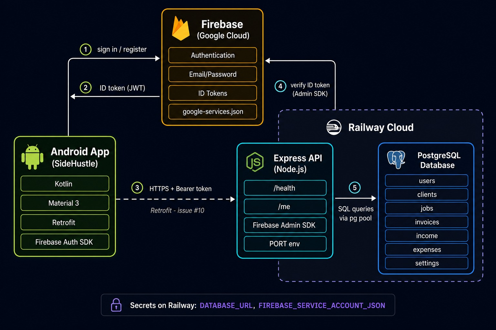

# SideHustle

An Android app for students, freelancers, and small side-hustle owners to manage **clients, jobs, income, expenses, and business performance** in one place.

This repository is the Part 2 prototype (and later the PoE). Source lives on GitHub only — no zip submissions.

**Status:** Phase 1 in progress — app skeleton, Firebase auth, hosted Express API + PostgreSQL on Railway, and Retrofit connected. Verified on a physical phone.

| Milestone | Progress |
| --- | --- |
| Phase 1 — Foundation, auth & API | Issues #1–#10 complete; #11 (profile API) next |
| Phase 2 — Core features | Not started |
| Phase 3 — Tests, polish, demo | Not started |
| PoE extras | Not started |

---

## Purpose

Side hustles are often run from a mix of chats, notes, and spreadsheets. SideHustle puts the admin in one app so users can:

- keep client details together
- track jobs/projects and their status
- record income and expenses
- see profit, outstanding payments, and a **SideHustle Score** on a dashboard

The prototype must compile and run, support register/login with encrypted passwords, let users change settings, talk to a **hosted REST API + database**, and survive invalid input without crashing.

---

## System architecture



### How everything connects

1. **Login / register (Android → Firebase)**  
   The app uses the Firebase Auth SDK. The user signs in with email and password. Firebase stores and verifies credentials — our API never sees the password.

2. **ID token (Firebase → Android)**  
   After a successful login, Firebase returns a short-lived **ID token** (JWT) to the app.

3. **API calls (Android → Railway Express API)**  
   Retrofit sends HTTPS requests to our hosted API. Protected routes include an auth header:  
   `Authorization: Bearer <Firebase ID token>`

4. **Token verification (Express → Firebase Admin)**  
   The API uses the Firebase Admin SDK to verify the token is valid and not expired before handling the request.

5. **Database (Express → PostgreSQL)**  
   After auth, the API reads and writes business data (users, clients, jobs, invoices, income, expenses, settings) in PostgreSQL on Railway.

| Endpoint | Auth required | Purpose |
| --- | --- | --- |
| `GET /health` | No | Check API and database status |
| `GET /me` | Yes | Return signed-in user's `uid` and `email` |

**Hosted API:** `https://sidehustle-production-f596.up.railway.app/`  
**Backend setup:** see [`backend/README.md`](backend/README.md)

---

## Tech stack

From our Part 1 design:

| Layer | Choice |
| --- | --- |
| Android UI | Kotlin, Material 3, Navigation Component |
| Auth | Firebase Authentication (email/password; passwords hashed by Firebase) |
| API client | Retrofit + Gson → hosted Node.js + Express API |
| Database | PostgreSQL on Railway |
| Files / push | Firebase Storage and FCM (PoE) |
| Offline | Room + sync (PoE) |

**Screens:** Login, Register, Dashboard, Clients, Client details, Projects, Project details, Invoices, Expenses, Settings.

**Deferred to PoE:** offline mode, Google Sign-In, FCM, file attachments, extra languages, final artwork.

**Libraries (why they are here)**

- **Firebase Auth** — assignment SDK; email/password login with hashed passwords
- **Retrofit + Gson** — REST calls to our hosted Railway API (issue #10)
- **Room** — not added yet; reserved for PoE offline mode

---

## Project structure

```text
SideHustle/
  app/                  Android app (Kotlin)
  backend/              Node.js + Express REST API
  System_Design.jpeg    Architecture diagram (above)
  .github/              CODEOWNERS, contributing guide
```

---

## How we use GitHub

- Repo: [RtCzee/SideHustle](https://github.com/RtCzee/SideHustle)
- Work is split into **milestones**: Phase 1 (foundation, auth, API), Phase 2 (core features), Phase 3 (tests, polish, demo), PoE
- Each task is a **GitHub issue** with an overview, behaviour, and completion checklist

### Branch workflow

| Branch | Who uses it | Purpose |
| --- | --- | --- |
| `issue/N-feature` | Teammates | Feature work for one issue |
| `dev` | Integration | All PRs merge here first |
| `master` | Lead reviewer | Stable, demo-ready code |

1. Branch off `dev` (not `master`)
2. Open a pull request into **`dev`**
3. @RtCzee reviews and merges
4. When ready, `dev` is merged into **`master`**

See [`.github/CONTRIBUTING.md`](.github/CONTRIBUTING.md) for the full guide.

---

## GitHub Actions

Not set up yet. We will add a workflow based on the module guides:

- [Automated Build Android App with GitHub Action](https://github.com/marketplace/actions/automated-build-android-app-with-github-action)
- [IMAD5112 sample `build.yml`](https://github.com/IMAD5112/Github-actions/blob/main/.github/workflows/build.yml)

Plan: run `./gradlew test` and a debug build on push/PR so the app is checked on GitHub's machines, not only on one laptop. A `release` branch will produce APK/AAB artifacts for submission.

---

## Running the app

1. Open the project in Android Studio
2. Sync Gradle
3. Run the `app` configuration on a phone or emulator (internet required for API calls)

**Quick check after login:** Dashboard should show *"Connected to the API as …"* — this confirms Retrofit → Railway → Firebase token verification works end-to-end.

**Navigation check:** Login → Register / Dashboard → bottom nav (Dashboard, Clients, Projects, Finances, Settings) → detail screens.

---

## Demo video

_Link will be added here after the Phase 3 demonstration video (voice-over, phone, hosted auth/API/database)._

---

## AI tools used

This section is the short write-up of how AI was used (under 500 words). It will be updated as we go.

**Tool:** Cursor (model: Cursor Grok 4.6), used inside the IDE as a coding assistant.

The **product idea is ours**. SideHustle, the competitor research, screens, data model, and tech choices come from our Part 1 document (`OPSC6312 Part 1`). AI did not invent the app concept.

**What AI has been used for so far**

1. **Planning** — GitHub issue list grouped into Phase 1–3 and PoE, each with a feature overview and completion requirements.
2. **GitHub setup** — drafting issues locally and pushing them to GitHub with the GitHub CLI.
3. **Issue #1 implementation** — Kotlin package layout (`ui`, `data`, `network`, `util`), Material 3, Navigation Component, placeholder screens, and bottom navigation.
4. **Auth screens** — register, login, session persistence, validation, and logout.
5. **Backend scaffold** — Express API, Firebase Admin middleware, PostgreSQL schema, Railway deployment guidance.
6. **Retrofit wiring** — API client, auth interceptor, and dashboard `/me` call (issue #10).
7. **Git workflow help** — branch naming, commit messages, `dev` branch protection, and PR workflow.
8. **Google Sign-In icon** — Cursor's image generator made a colourful G (`ic_google_logo.png`). Android's Material button tinted that PNG lime-green, so the on-screen button uses a transparent vector G (`ic_google_g.xml`) with tint turned off. Google Sign-In itself is still a later issue.
9. **System architecture diagram** — initial diagram generated in Cursor; final version saved as `System_Design.jpeg` in the repo root.

<small><em>In summary, AI was used for planning, scaffolding, and automating repetitive implementation steps.</em></small>

**What was not done by AI**

- Running and checking the app on a **physical phone** in Android Studio
- Fixing Gradle/Kotlin plugin build errors and verifying navigation on device
- Creating the Firebase project, Railway account, and PostgreSQL database in the cloud
- Final review and merge decisions on pull requests

**Citation**

Cursor (2026). *Cursor Grok 4.6* coding assistant. Used for assignment planning, GitHub issue setup, app skeleton, auth screens, backend scaffold, Retrofit wiring, README drafts, and deployment guidance. Human team members reviewed the output, ran the app on a device, and keep ownership of design decisions.

Cursor (2026). *GenerateImage*. Used to create the Google-style G icon and an early system architecture diagram for SideHustle.

---

## Team

Work is on GitHub under [RtCzee/SideHustle](https://github.com/RtCzee/SideHustle).

| GitHub | Name |
| --- | --- |
| [RtCzee](https://github.com/RtCzee) | Didintle Mokgoro |
| [sibongiseni-ngwamba](https://github.com/sibongiseni-ngwamba) | Sibongiseni Ngwamaba |
| [Globoysosa](https://github.com/Globoysosa) | Thokozani Masondo |
| [OnesimoTuswa](https://github.com/OnesimoTuswa) | Onesimo Tuswa |
